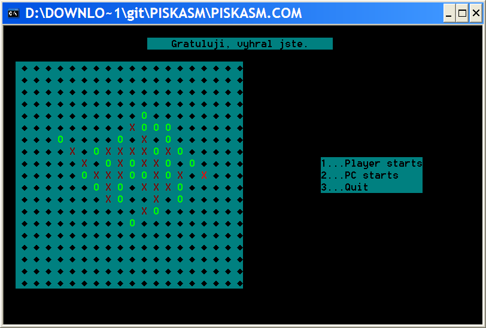

Whistle a program for playing Gomoku humans or against the computer on board the dimensions 19 * 19. Made in Turbo Assembler for 8086.  Application: No installation is necessary. The program is run piskasm.com file.

You whistle - PrograÃ¥torskÃ¥ documentation Whistle a program for playing gomoku gomoku humans or against the computer on board the dimensions 19 * 19th The program is written in Borland Turbo Assembler for 8086 processor and memory TINY model, the resulting executable file is .COM. Source file PISKASM.ASM translate commands: TASM PISKASM.ASM TLink / t PISKASM.OBJ The program stores information about the state of the game especially in the area of â??â??data structures and Info. Area: A two-dimensional array of bytes Procedure 19 * 19. Visit [Face + 19 * i + j] is stored, whether it is in the i-th row, j-th column laid stone (where columns and rows are numbered from 0). A value of 0 indicates an empty field, 1 indicates poÄ?ítaÄ?ův stone (hash) 2 and the player's stone (wheel). Info: Dimensional array dvoubytů order of 19 * 19, where your computer stores score possible moves. If the field is occupied, or move unpromising, there is stored 0th The program consists of a main part and subroutines. The main part of the first saved segment videoRAM in the EC registry, where it is stored most of the time program. Then subroutine Intro, which lists the welcome message. Then use the mouse interrupt 51 is turned on. If the mouse is not switched on, the program immediately ends. Then the program gets to label Restart where the subroutine is called Newgate, which lists call for a new game. Using dos interrupt is determined by the option chosen by the user, and if not completed the program, calling the procedure NewBoard, which delineates the new board and initializes Desktop and Info. In the event that he was elected start the computer at random (see below) instead of near the middle of the plate, which kick off the computer. The last computer's move is always stored at the address LastPC for later redraw highlighted common cross. After laying each stone has always subroutine Update that updates Info and tests whether there towards the end of the game. Also decrements counter unoccupied VolnaPole that is used to detect the draw. After the first draw of the eventual PC program enters the main cycle (label FirstMove), which in turn processes the given player moves the mouse and moves the computer-generated PCMove subroutine (see below). When someone wins or there is a tie, the program displays a winning message and returns to label Restart. When a player signs must draw program off the mouse, which is not located at the place where you want to draw. Otherwise, the brand drew the wrong color. Random numbers The program uses a simple method of generating random numbers. When the program in the main menu and waits for input from the player constantly incrementing register BX. When input comes BX is stored in the address Random. A random number is then recovered GetRandom subroutine that returns the contents of memory at random and generates another random number, so that added to the Random 4567. 4567 is prime and therefore are all random numbers from 0 to FFFFh generated as frequently. 4567 is a bit small number, so the top bits of random numbers change only once every few generations, but in this case it does not matter because we always use only the lower bits of random numbers. Artificial Intelligence" Selecting strokes computer in addition to the first turn as follows: The info is still stored scoring possible moves. PCMove subroutine selects the move so that from a randomly selected sites undergoing Info first forward, then backward, and selects the first found traction with the maximum score. In this way but selects only move that has a rating of greater than 0 and must therefore if you have all the possible moves rating of 0 (this occurs when the board is nearly full and you can not win) to select the first possible move by browsing areas. Strokes are scored as follows: At the beginning of the game is initiated info zeros. After each turn, is in the subroutine Update updated assessment of the occupied field to 0, and the free adjacent squares (eight in all directions to a distance of four boxes) are pÅ?ebodovÃ¥na subroutine CountScore. Countscore counts points move according to the "units" on the board by laying the stones occur in each direction separately, and adds them together. Scoring each unit is stored in a data structure scoring, which is indexed binary-encoded mask that body. Departments have a length of 5, 6 or 7 boxes. For each direction, then in the sum of points per turn added the most points ranking department (of the five-sedmipolíÄ?kových offensive and defensive) in a given direction by the tension created. It's called. Static evaluation function, ie. Not trying to not be searched opponent's countermoves forward, not used any minimax. Known deficiencies: Program at the failure to detect the mouse does not write any error message and simply end. Artificial intelligence does not allow so-called. Porches. For example, if a player can face deadly roof "4 + 3", the computer still commits suicide attack when drawing up the trio. Game can not interrupt until someone wins or there is a tie. Program VojtÄ?ch Havranek wrote in September 2004 as a credit program at Charles University. vojtech.havranek@matfyz.cz Gomoku tournament: www.gomocup.wz.cz For more information, see the user dokumetace (uzivatel.txt). Whistle - User Documentation Whistle a program for playing gomoku gomoku humans or against the computer on board the dimensions 19 * 19th Application: No installation is necessary. The program is run piskasm.com file. Keys 1, 2 or 3 to choose whether to begin human or computer, or whether you want to quit the game. The program can only play one player against the computer (a game between two players you do not need a computer) game itself is controlled with the mouse, just click on the box to where you want to place a stone. The last computer's move is highlighted in bright red. The program can not jump out during the game, you first have to win or be defeated. There is only one difficulty level at which certainly with a little patience you can beat the computer. Rules Gomoku Players alternately place the stones on the board. Stones can not be taken back, move or occupy. The player who was the first to ask manage 5 or more stones beside him to the series is the winner. In the event that the entire board is occupied without anyone won, the game ends in a draw. Demands The program is designed for operating system MS-DOS. Needs any PC, 2.5 kilobytes of disk space, monitor (color recommended), keyboard and mouse. Program VojtÄ?ch Havranek wrote in September 2004 as a credit program at Charles University. vojtech.havranek@matfyz.cz www.gomocup.wz.cz For more information on programming dokumetace (progr.txt).
